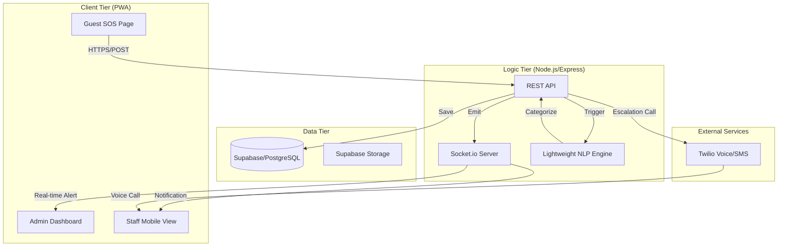

# 🚨 Respondr: Rapid Crisis Response & Coordination

**"In emergencies, every second matters. Our system reduces response time from minutes to seconds."**

Respondr is a mission-critical emergency coordination platform designed for the hospitality industry. It utilizes real-time communication, automated escalation, and AI-driven classification to ensure that no distress signal goes unheard.

---

## 🏗️ System Architecture



---

## 🛠️ Detailed Project Structure

```text
Respondr/
├── frontend/                # Next.js 14 (App Router)
│   ├── public/              # Alert sounds, high-res hotel maps, PWA icons
│   ├── src/
│   │   ├── app/             # Application entry points
│   │   │   ├── sos/         # Guest SOS trigger interface
│   │   │   ├── admin/       # Dashboard for hotel management
│   │   │   └── staff/       # Mobile-optimized task view for responders
│   │   ├── components/      # Shared UI (Cards, Modals, SOS Button)
│   │   ├── hooks/           # Custom hooks for Sockets & Data fetching
│   │   ├── lib/             # API clients (Supabase, Socket.io-client)
│   │   └── store/           # Global state (Zustand/Context) for active alerts
├── backend/                 # Node.js + Express
│   ├── src/
│   │   ├── controllers/     # Incident & Staff logic
│   │   ├── middleware/      # Auth, Rate-limiting, Error Handling
│   │   ├── routes/          # API Route definitions
│   │   ├── services/        # Twilio, AI/NLP, Supabase integrations
│   │   ├── sockets/         # Socket.io event handlers
│   │   └── index.ts         # Server entry & Socket initialization
├── supabase/                # Database layer
│   └── schema.sql           # Detailed DDL (Tables, Views, RLS Policies)
├── .planning/               # GSD Project Planning
└── README.md                # Project documentation
```

---

## 📊 Database Schema (Supabase)

### `incidents` Table
| Column | Type | Description |
| :--- | :--- | :--- |
| `id` | UUID (PK) | Unique incident identifier |
| `room_no` | VARCHAR | Hotel room or location ID |
| `category` | ENUM | 'Medical', 'Fire', 'Security' |
| `description` | TEXT | Optional user-provided details |
| `status` | ENUM | 'Reported', 'In Progress', 'Resolved', 'Escalated' |
| `guest_phone` | VARCHAR | Contact number for the reporting guest |
| `assigned_staff_id` | UUID (FK) | Reference to the assigned staff member |
| `created_at` | TIMESTAMP | Auto-generated timestamp |
| `resolved_at` | TIMESTAMP | Timestamp when status hits 'Resolved' |

### `staff` Table
| Column | Type | Description |
| :--- | :--- | :--- |
| `id` | UUID (PK) | Unique staff identifier |
| `name` | VARCHAR | Full name of staff member |
| `role` | VARCHAR | e.g., 'Security', 'Nurse', 'Manager' |
| `phone_number` | VARCHAR | Twilio-compatible phone for escalation calls |
| `is_online` | BOOLEAN | Current availability status |

---

## 🔌 API & Real-time Documentation

### REST Endpoints
- **POST `/api/v1/incidents`**: Trigger a new SOS.
  - Payload: `{ room_no, category, description, guest_phone }`
- **PATCH `/api/v1/incidents/:id/status`**: Update incident state.
- **GET `/api/v1/staff/online`**: List all available responders.

### Socket.io Events
- **Server -> Client (`new_incident`)**: Broadcasts new alert to all Admin/Staff sessions.
- **Client -> Server (`acknowledge_incident`)**: Staff signals they are responding.
- **Server -> Client (`incident_updated`)**: Real-time status sync across all dashboards.

---

## 🔄 The "No-Human-Touch" Workflow (In-Depth)

1.  **Detection**: Guest triggers SOS. The backend receives the request and immediately persists it to Supabase.
2.  **AI Routing**: An NLP utility parses the `description`. 
    - *Example*: "Help, there's a fire in 304!" -> System sets category to `Fire` and priority to `Critical`.
3.  **Instant Dispatch**: The Socket.io server broadcasts to the Admin and relevant Staff.
4.  **Escalation Logic**:
    - **T=0s**: Push notification sent to Staff Mobile.
    - **T=15s**: If no "Acknowledge" event is received, a reminder SMS is sent.
    - **T=30s**: **Automated Voice Call** initiated via Twilio. The AI Voice reads: *"Emergency Alert. Incident 402, Fire reported in Room 304. Please acknowledge."*
5.  **Resolution**: Once staff arrives, they hit "Resolve" on their phone. The guest receives a confirmation SMS, and the incident is archived.

---

## ⚡ Setup & Deployment

### Prerequisites
- Node.js v18+
- Supabase Project (PostgreSQL + Auth)
- Twilio Account (for Voice/SMS)

### Environment Variables
```env
# Backend
PORT=3001
SUPABASE_URL=...
SUPABASE_SERVICE_ROLE_KEY=...
TWILIO_ACCOUNT_SID=...
TWILIO_AUTH_TOKEN=...
TWILIO_FROM_NUMBER=...

# Frontend
NEXT_PUBLIC_SUPABASE_URL=...
NEXT_PUBLIC_SUPABASE_ANON_KEY=...
NEXT_PUBLIC_BACKEND_URL=http://localhost:3001
```

---

## 🚀 Future Roadmap
- **Wearable Integration**: Sync with Apple Watch/Fitbit for heart-rate triggered SOS.
- **Indoor Positioning**: Using Bluetooth Beacons to pinpoint exact guest location within the hotel.
- **Multi-Tenant Support**: SaaS platform for multiple hotel chains.

---

Built with ❤️ for the future of hospitality safety.

